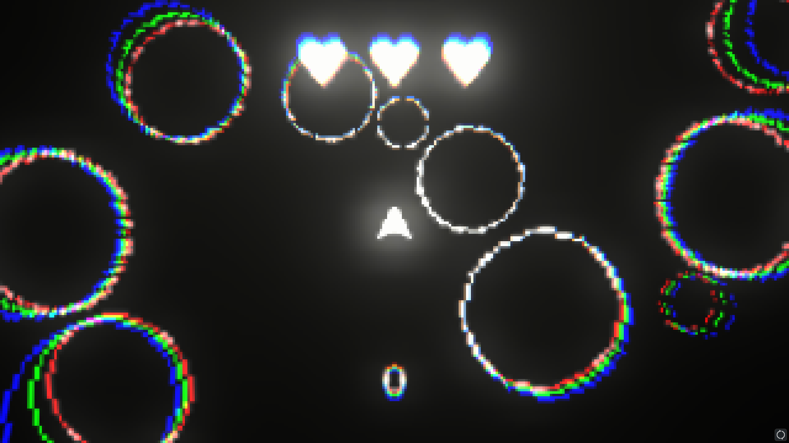

# CirculationUnity

Circulation is a personal hobby project aiming to explore circle-to-circle collision handling within Unity. The primary focus was to implement this collision mechanism independently, emphasizing simplicity and maintaining a clean code structure. This project is intended to serve as an educational example within Unity, demonstrating clean coding practices and various related examples.

Features:
Custom Circle-to-Circle Collision Handling: Implemented a custom solution for circle-to-circle collisions within the Unity environment.
Emphasis on Clean Code: Demonstrates the use of organized and well-structured code to encourage readability and understanding.
Educational Purpose: Intended as an example project to aid developers in learning and implementing similar functionalities.

Purpose:
The purpose of this project is to showcase an isolated aspect of game development—specifically, handling circle-to-circle collisions—while also emphasizing the significance of maintaining a clean and well-structured codebase. Developers can use this project as a reference point to understand how to implement such functionality within their Unity projects efficiently.

Usage:
Feel free to explore the provided codebase and examples to understand the implementation of circle-to-circle collision handling. Use this project as a learning resource to improve your understanding of clean coding practices within the Unity framework.

Contributing:
Contributions are welcome! If you'd like to contribute by adding more functionalities, improving existing code, or fixing bugs, please feel free to submit a pull request.